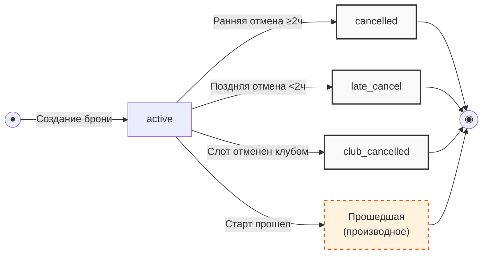

## ER-модель системы

```mermaid
erDiagram
    %% СУЩНОСТИ (СПРАВОЧНИКИ) - ТОЛЬКО ЧТЕНИЕ
    Route {
        uuid id PK
        string name
        string description
        enum type "novice|experienced"
        int capacity_cap "≤8 нович/≤12 опыт"
        int duration_min
        polyline geometry
    }
    
    Instructor {
        uuid id PK
        string name
    }
    
    Slot {
        uuid id PK
        uuid route_id FK
        uuid instructor_id FK
        datetime start_at "UTC"
        int total_seats
        int free_seats
        int free_rental_boards
        money price "за место"
        money rental_price "за доску"
        string meeting_point
        float meeting_point_lat
        float meeting_point_lng
        enum status "scheduled|cancelled"
    }

    %% СУЩНОСТЬ (РАБОЧАЯ) - ЧТЕНИЕ + ЗАПИСЬ
    Client {
        uuid id PK
        string name
        string phone UK
        datetime created_at
    }

    %% СУЩНОСТЬ (РАБОЧАЯ) - СОЗДАЕТСЯ/ОТМЕНЯЕТСЯ
    Booking {
        uuid id PK
        uuid slot_id FK
        uuid client_id FK
        int seats_count "1..3"
        int rental_count "0..seats_count"
        enum status "active|cancelled|late_cancel|club_cancelled"
        money price_total "read-only, расчет сервера"
        datetime created_at
        datetime cancelled_at
    }

    %% СВЯЗИ
    Route ||--o{ Slot : "определяет"
    Instructor ||--o{ Slot : "ведет"
    Client ||--o{ Booking : "создает"
    Slot ||--o{ Booking : "содержит"

    %% ЛЕГЕНДА
    Route ||--o{ Slot : "read-only (справочник)"
    Instructor ||--o{ Slot : "read-only (справочник)"
    Slot ||--o{ Booking : "read-only (проекция)"
    Client ||--o{ Booking : "чтение + запись"
    Booking : "чтение + запись (создание/отмена)"
```

---

## 2. Модели сущностей

### 2.1. Route (Маршрут) — **ТОЛЬКО ЧТЕНИЕ**
*Справочник, поставляется бэкендом. Приложение не создает и не изменяет.*

| Атрибут | Тип | Обязательность | Описание |
|:---|:---|:---|:---|
| `id` | UUID | ✅ | Идентификатор маршрута |
| `name` | string | ✅ | Название маршрута |
| `description` | string | ❌ | Описание маршрута (может быть null) |
| `type` | enum | ✅ | `novice` (новичковый) или `experienced` (опытный) |
| `capacity_cap` | int | ✅ | Максимум мест: новичковый ≤ 8, опытный ≤ 12 |
| `duration_min` | int | ✅ | Длительность в минутах (≈90–120) |
| `geometry` | polyline | ✅ | Координаты маршрута для карты |

---

### 2.2. Instructor (Инструктор) — **ТОЛЬКО ЧТЕНИЕ**
*Справочник, поставляется бэкендом. Приложение не создает и не изменяет.*

| Атрибут | Тип | Обязательность | Описание |
|:---|:---|:---|:---|
| `id` | UUID | ✅ | Идентификатор инструктора |
| `name` | string | ✅ | Имя инструктора |

---

### 2.3. Slot (Слот / Тренировка) — **ТОЛЬКО ЧТЕНИЕ**
*Проекция данных бэкенда. Приложение читает, но не создает и не изменяет.*

| Атрибут | Тип | Обязательность | Описание |
|:---|:---|:---|:---|
| `id` | UUID | ✅ | Идентификатор слота |
| `route_id` | UUID (FK) | ✅ | Ссылка на маршрут |
| `instructor_id` | UUID (FK) | ✅ | Ссылка на инструктора |
| `start_at` | datetime (UTC) | ✅ | Время старта в UTC. **Источник истины для расчета отмены** |
| `total_seats` | int | ✅ | Всего мест (≤ capacity_cap) |
| `free_seats` | int | ✅ | Свободных мест (денормализованное поле) |
| `free_rental_boards` | int | ✅ | Свободных прокатных досок (из 12) |
| `price` | money (RUB) | ✅ | Цена за одно место |
| `rental_price` | money (RUB) | ✅ | Цена за одну прокатную доску |
| `meeting_point` | string | ✅ | Текст места встречи |
| `meeting_point_lat` | float | ✅ | Широта точки сбора |
| `meeting_point_lng` | float | ✅ | Долгота точки сбора |
| `status` | enum | ✅ | `scheduled` или `cancelled` |

**Примечание:** `free_seats` и `free_rental_boards` — денормализованные поля, которые обновляются бэкендом при создании/отмене броней.

---

### 2.4. Client (Клиент) — **ЧТЕНИЕ + ЗАПИСЬ**
*Основная сущность пользователя. Приложение создает (регистрация) и читает.*

| Атрибут | Тип | Обязательность | Описание |
|:---|:---|:---|:---|
| `id` | UUID | ✅ | Идентификатор клиента |
| `name` | string | ✅ | Имя клиента |
| `phone` | string (unique) | ✅ | Номер телефона — логин |
| `created_at` | datetime | ✅ | Дата регистрации |

**Операции приложения:**
- **Чтение:** получение данных клиента (имя, телефон, история)
- **Запись:** создание при регистрации (шаг 3 — ввод имени)
- **Изменение:** смена телефона (с подтверждением через OTP)

---

### 2.5. Booking (Запись / Бронь) — **ЧТЕНИЕ + ЗАПИСЬ**
*Основная рабочая сущность. Приложение создает (запись) и изменяет (отмена).*

| Атрибут | Тип | Обязательность | Описание |
|:---|:---|:---|:---|
| `id` | UUID | ✅ | Идентификатор записи |
| `slot_id` | UUID (FK) | ✅ | Ссылка на слот |
| `client_id` | UUID (FK) | ✅ | Ссылка на клиента |
| `seats_count` | int | ✅ | Количество мест (1–3) |
| `rental_count` | int | ✅ | Из них на прокатных досках (0..seats_count) |
| `status` | enum | ✅ | `active`, `cancelled`, `late_cancel`, `club_cancelled` |
| `price_total` | money (RUB) | ✅ | **READ-ONLY.** Итоговая цена, рассчитанная сервером |
| `created_at` | datetime | ✅ | Время создания |
| `cancelled_at` | datetime | ❌ | Время отмены (если была) |

**Операции приложения:**
- **Чтение:** просмотр списка броней, деталей брони
- **Запись:** создание брони (`POST /bookings`)
- **Изменение:** отмена брони (`POST /bookings/{id}/cancel`)

**Статусы брони:**
| Статус | Описание | Когда возникает |
|:---|:---|:---|
| `active` | Активна | После успешного создания |
| `cancelled` | Отменена клиентом (ранняя) | Отмена ≥ 2ч до старта |
| `late_cancel` | Отменена клиентом (поздняя) | Отмена < 2ч до старта |
| `club_cancelled` | Отменена клубом | Слот отменен администратором |

**Инварианты:**
- `seats_count ∈ [1, 3]` — макс. 3 места на одну бронь
- `rental_count ∈ [0, seats_count]` — прокатных досок не больше мест
- `price_total` — рассчитывается сервером как `price × seats_count + rental_price × rental_count`
- При ранней отмене (`cancelled`) места и доски возвращаются в слот
- При поздней отмене (`late_cancel`) места и доски НЕ возвращаются

## 3. Сводная таблица операций

| Сущность | Чтение | Создание | Изменение | Удаление |
|:---|:---:|:---:|:---:|:---:|
| **Route** | ✅ | ❌ | ❌ | ❌ |
| **Instructor** | ✅ | ❌ | ❌ | ❌ |
| **Slot** | ✅ | ❌ | ❌ | ❌ |
| **Client** | ✅ | ✅ | ✅ (телефон) | ❌ (анонимизация) |
| **Booking** | ✅ | ✅ | ✅ (отмена) | ❌ |


## 4. Sequence-диаграмма: createBooking

### Сценарий: Создание брони (запись на тренировку)

**Актор:** Клиент
**Экран:** SCR-04 (Оформление записи)
**API:** `POST /bookings`


## 5. Таблица ответов API для createBooking

| Код | Сценарий | Действие приложения |
|:---|:---|:---|
| **201** | Успешное создание брони | Показ BS-002, переход на SCR-06 |
| **400** | Невалидные данные (некорректный JSON) | Подсказка по формату |
| **401** | Токен истек / невалиден | Переход на SCR-01 (Вход) |
| **404** | Слот не найден | Сообщение «Слот не найден» |
| **409** | Нет свободных мест (`slot_full`) | Показ сообщения с `available_seats` |
| **409** | Нет прокатных досок (`rental_unavailable`) | Показ сообщения с `available_rental_boards` |
| **409** | Двойная бронь (`double_booking`) | «Вы уже записаны на эту тренировку» |
| **410** | Слот отменен клубом (`slot_cancelled`) | «Прогулка отменена, запись недоступна» |
| **422** | Слот уже стартовал (`slot_started`) | «Запись на прошедшую тренировку невозможна» |
| **422** | Другие ошибки валидации | Подсказка по полям |
| **500** | Внутренняя ошибка сервера | «Что-то пошло не так. Попробуйте позже» |
| **Таймаут** | Нет ответа от сервера (~10с) | «Ошибка сети. Повторить?» (с тем же Idempotency-Key) |


## 6. Sequence-диаграмма: cancelBooking

### Сценарий: Отмена брони

**Актор:** Клиент
**Экран:** SCR-06 (Детали брони) → BS-003 (Подтверждение)
**API:** `POST /bookings/{bookingId}/cancel`


## 7. Таблица ответов API для cancelBooking

| Код | Сценарий | Действие приложения |
|:---|:---|:---|
| **200** | Ранняя отмена (≥2ч) → `cancelled` | «Бронь отменена. Место освобождено» |
| **200** | Поздняя отмена (<2ч) → `late_cancel` | «Поздняя отмена: место не освобождено» |
| **401** | Токен истек / невалиден | Переход на SCR-01 (Вход) |
| **403** | Чужая бронь | «У вас нет прав на эту бронь» |
| **404** | Бронь не найдена | «Бронь не найдена» |
| **409** | Уже отменена (`already_cancelled`) | Актуализация статуса |
| **422** | Слот уже стартовал (`slot_started`) | «Отмена недоступна» |
| **500** | Внутренняя ошибка сервера | «Попробуйте позже» |
| **Таймаут** | Нет ответа от сервера (~10с) | «Ошибка сети. Повторить?» |


## 8. Модель состояний Booking (жизненный цикл)



| Переход | Условие | Эффект на слот | Трасса |
|:---|:---|:---|:---|
| Создание → `active` | `free_seats ≥ seats_count` и `free_rental_boards ≥ rental_count` | `free_seats -= seats_count`; `free_rental_boards -= rental_count` | UC-01 |
| `active` → `cancelled` | Отмена ≥ 2ч до старта | Места и доски **возвращаются** в слот | UC-03 (ранняя) |
| `active` → `late_cancel` | Отмена < 2ч до старта | Места и доски **НЕ возвращаются** | UC-03 (поздняя) |
| `active` → `club_cancelled` | Слот отменен клубом | Слот снят, уведомление | R-008 |
| `active` → `past` (производное) | `start_at` < NOW() | Отмена недоступна | UC-03 E1 |

---

## 9. Инварианты целостности

1. **Мест:** `Slot.free_seats = Slot.total_seats - Σ(active + late_cancel).seats_count`
2. **Прокатных досок:** `Slot.free_rental_boards = 12 - Σ(active + late_cancel).rental_count`
3. **Ограничение брони:** `seats_count ∈ [1, 3]`, `rental_count ≤ seats_count`
4. **Атомарность:** Создание/отмена брони — в одной транзакции (FOR UPDATE)
5. **Идемпотентность:** `Idempotency-Key` защищает от двойной брони
6. **Источник истины:** Тип отмены (ранняя/поздняя) определяется сервером по `slot.start_at` в UTC

---

## 10. Связь с файлами требований

| Модель | Файл | Раздел |
|:---|:---|:---|
| Route, Instructor, Slot | `data-model.md` | Сущности и атрибуты |
| Client, Booking | `data-model.md` | Сущности и атрибуты |
| createBooking | `api-sequence.md` | Сценарий 1 |
| cancelBooking | `api-sequence.md` | Сценарий 2 |
| Статусы Booking | `data-model.md` | Модель состояний |
| Инварианты | `data-model.md` | Ключевые инварианты |
| Тип отмены (2ч граница) | `data-model.md` | R-021, foundations §6 |